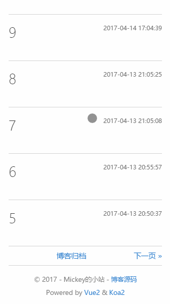

# Blog
A blog system. Based on Vue2, Koa2, MongoDB...

前后端分离项目的博客系统，前端SPA + 后端RESTful服务器

## 更新日志

> 2017/04/03：完成前端展示界面View级组件的编写
>
> 2017/04/04：将前端页面路由部署完毕，编写完博客后台管理界面View级组件，将后端管理平台的路由部署完毕
>
> 2017/04/05：完善博客管理平台消息通知系统，增加页面载入进度条，编写管理平台登录界面，开始编写后台restful接口
> 
> 2017/04/06：大致完成Restful接口tag部分，前端部署Vuex，完成前端和后台关于tag的数据交互
>
> 2017/04/07：完成博客后台管理平台和后端的数据通信，根据Vuex完善部分组件内部数据
>
> 2017/04/08：完成博客前端显示界面和后台的数据通信，去除两个界面sass的scoped标签使得v-html动态添加的内容能够着上样式，明天修改后台管理平台左边nav的active问题和前端query分页问题
>
> 2017/04/09：完成博客管理平台的密码登录和验证
>
> 2017/04/10：完成前端博客界面每篇文章的目录显示，兼容移动端，原理是采用正则表达式进行匹配
>
> 2017/04/11：完成文章页面跳转上一篇和下一篇文章的功能，修复博客文章目录float的bug
>
> 2017/04/12：修复后台管理平台左边nav刷新时候active不正确的bug，使用了:default-active
>
> 2017/04/13：修复博客管理平台几个bug，博客前端界面增加分页，一页最多10篇文章
>
> 2017/04/14：修复从博客管理界面点击查看错误路由bug，博客管理界面增加分页，一页最多12篇文章，为博客编辑界面添加样式，需要去掉scoped才能使得动态添加上去的元素获得样式
>
> 2017/04/15：跨域cookie获取失败，目前使用H5的sessionStorage来设置登录信息
>
> 2017/04/17：修复部分bug，编写readme

## 特点
* 支持markdown编写
* 兼容各种设备
* 清新简约的风格

## 功能特点显示
* pc端博客界面


* 移动端博客界面



* pc端博客管理平台


## 编写使用工具

**前端工具**

* Vue2.0
* Vue-Router
* Vuex
* axios
* element-ui
* sublime

前端兼容了pc端和移动端，使用了flexbox布局，关于flexbox请阅读[一个完整的Flexbox指南](http://www.w3cplus.com/css3/a-guide-to-flexbox-new.html)以及这篇最新的[理解Flexbox：你需要知道的一切](http://www.w3cplus.com/css3/understanding-flexbox-everything-you-need-to-know.html)

本项目还采用了手机端适配，关于移动端的学习资料请按照我下面罗列的资料按顺序仔细阅读。

1. [移动端调试](https://segmentfault.com/a/1190000002565572)
2. [介绍vieport](http://www.css88.com/archives/6410)
4. [使用Flexible实现手淘H5页面的终端适配](https://github.com/amfe/article/issues/17)


**后端工具**

* Koa全家桶
* vscode

后端的管理界面我直接使用了[element ui](http://element.eleme.io/#/)这个基于vue的组件库，很强大

## 目录结构

```

│  README.md
│  
├─client
│  │  .babelrc
│  │  .gitignore
│  │  index.html
│  │  package.json
│  │  webpack.config.js
│  │  
│  └─src
│      │  main.js
│      │  
│      ├─api
│      │      dealTime.js
│      │      generateTree.js
│      │      
│      ├─assets
│      │      avatar.jpg
│      │      loginBg.jpg
│      │      sideBar.jpg
│      │      webp.ico
│      │      
│      ├─components
│      │  │  App.vue
│      │  │  
│      │  ├─admin
│      │  │      Account.vue
│      │  │      ArticleEdit.vue
│      │  │      ArticleList.vue
│      │  │      Back.vue
│      │  │      LabelManage.vue
│      │  │      Login.vue
│      │  │      Overview.vue
│      │  │      
│      │  └─front
│      │          About.vue
│      │          Archive.vue
│      │          Article.vue
│      │          ArticleList.vue
│      │          Front.vue
│      │          Index.vue
│      │          LabelContent.vue
│      │          Pagination.vue
│      │          SideBar.vue
│      │          SmallLabel.vue
│      │          
│      ├─css
│      │      animate.css
│      │      font-awesome.min.css
│      │      
│      ├─fonts
│      │      fontawesome-webfont.eot
│      │      fontawesome-webfont.svg
│      │      fontawesome-webfont.ttf
│      │      fontawesome-webfont.woff
│      │      fontawesome-webfont.woff2
│      │      FontAwesome.otf
│      │      
│      ├─router
│      │      admin.js
│      │      front.js
│      │      index.js
│      │      
│      ├─sass
│      │  ├─admin
│      │  │      account.scss
│      │  │      articleEdit.scss
│      │  │      back.scss
│      │  │      login.scss
│      │  │      overview.scss
│      │  │      
│      │  └─front
│      │          about.scss
│      │          archive.scss
│      │          article.scss
│      │          articleList.scss
│      │          front.scss
│      │          general.scss
│      │          labelContent.scss
│      │          pagination.scss
│      │          sideBar.scss
│      │          smallLabel.scss
│      │          
│      └─store
│              index.js                 
└─server
    │  app.js
    │  controller.js
    │  package.json
    │  start.js
    │  前后端通信api.txt
    │  
    ├─.vscode
    │      launch.json
    │      
    ├─api
    │      index.js
    │      
    ├─controllers
    │      account.js
    │      article.js
    │      tag.js
    │      
    ├─model
    │      mongo.js
    │      
    └─model_rest
            accountAction.js
            articleAction.js
            tagAction.js

```

## Step

**环境**

* Node.js V6
* MongoDB(Mongoose)
* 推荐[Robomongo](https://robomongo.org/)作为数据库的可视化管理工具

**克隆远程库**

git clone git@github.com:mickey0524/Blog.git

**安装前后端依赖**

克隆后在client和server目录下执行npm install命令

**启动后端服务器**

进入到server文件夹下: node start.js

**启动前端项目**

进入到client文件夹下: npm run dev

**生成发布**

npm run build

## License

MIT

